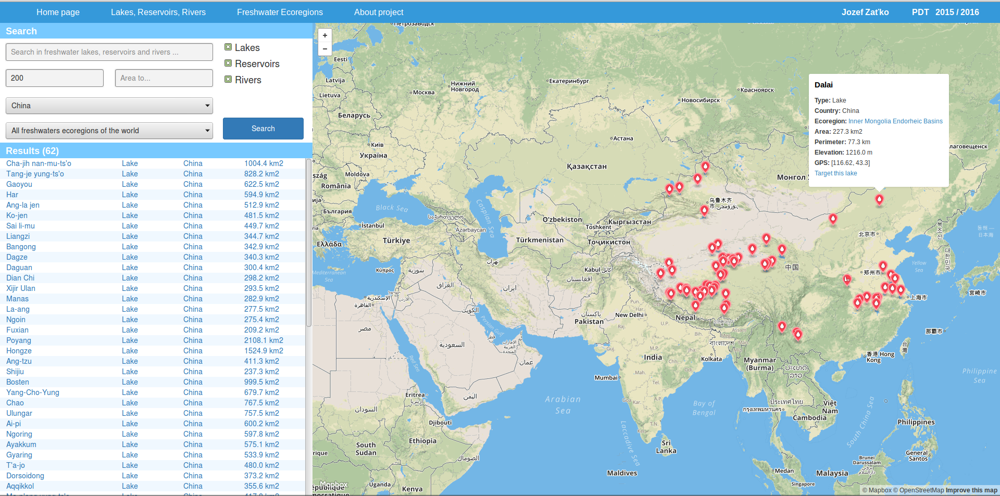
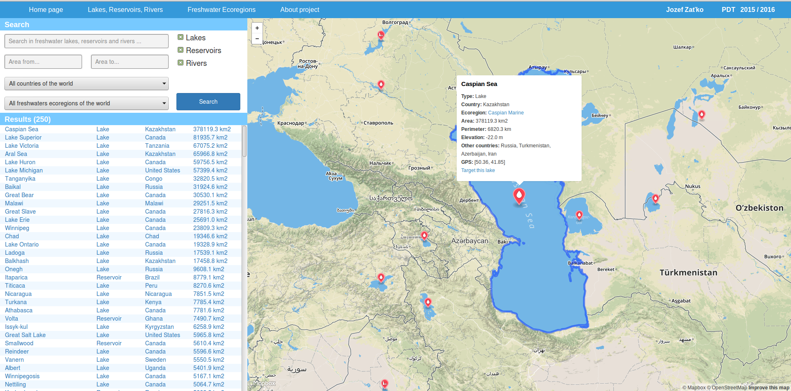
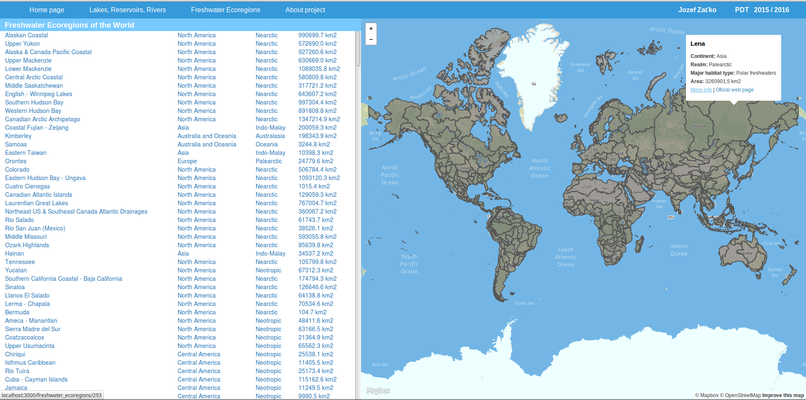
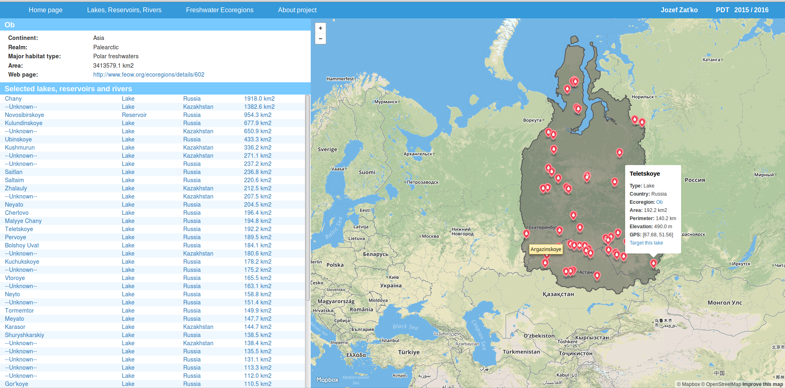

## Overview

This application written in Ruby on Rails(v4.2.4) shows freshwater lakes, reservoirs and rivers of the world with related ecoregions. Most important features are:
- search in freshwater lakes, reservoirs and rivers by name, area, country, ecoregion, type
- show details and coordinates of freshwater lakes, reservoirs and rivers on map
- show freshwater ecoregions of the world with details on map
- show lakes, reservoirs and rivers for selected ecoregion

[Project source with specification](https://github.com/jozefzatko/assignment-gis-jozefzatko/)

## Screenshots

Search in freshwater lakes, reservoirs and rivers by different parameters

Show details of lake

All ecoregions of the world

Ecoregion details

## Frontend
Application frontent consists of:
- Mapbox(v2.2.2) map showing freshwater geodata and referenced from other views - `gis_rails_app/app/views/to_render/map/_map.html.erb`
- Application views locatated in: `gis_rails_app/app/views`
	
Frontend views get data directly from Rails controllers. Communication between Javascript of Mapbox and Rails controllers is provided by Gon gem. Mapbox frontend shows array of GeoJSON-s on the map. This arrray is created in controllers.

Lakes, reservoirs and rivers are shown as Mapbox markers, ecoregions as geometry.

## Backend
Application backend retrieves geodata from database. Application has defined 4 models in `gis_rails_app/app/models`:
- Country (all countries of the world)
- Continent (continents of the world)
- Freshwater (selected freshwater lakes, reservoirs and rivers)
- FreshwaterEcoregion (426 freshwater ecoregions of the world according to WWF organisation)

Models provide mainly data preprocessing.

Selection of data for views is implemented in controllers `freshwaters_controller.rb` and `freshwater_ecoregions_controller.rb`

Data are selected using ActiveRecord. ST functions are executed by raw SQL queries.

## Database
Application database is build on PostgreSQL (v9.3) with PostGIS extension (v2.2). 
Schema is captured in `gis_rails_app/db/schema.rb`.

Data seed into db is implemented in `gis_rails_app/db/seeds.rb`. Majority of ST functions are executed here because of performance.

## Used data
Used geodata was originally in Shapefile format. Data were converted into .geojson format using [ogr2ogr](http://www.gdal.org/ogr2ogr.html) and [mapshaper](http://mapshaper.org/)

Data: [https://github.com/jozefzatko/assignment-gis-jozefzatko/tree/master/data](https://github.com/jozefzatko/assignment-gis-jozefzatko/tree/master/data)